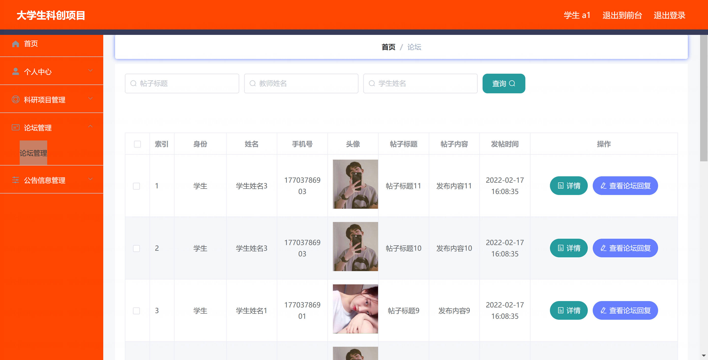

基于 Spring Boot 的大学生科创项目在线管理系统（程序+论文）
=

### 完整代码获取地址：从戎源码网 ([https://armycodes.com/](https://armycodes.com/))
### 作者微信：19941326836  QQ：952045282 
### 承接计算机毕业设计、Java毕业设计、Python毕业设计、深度学习、机器学习
### 选题+开题报告+任务书+程序定制+安装调试+论文+答辩ppt 一条龙服务
### 所有选题地址https://github.com/nature924/allProject

一、项目介绍
---
基于SpringBoot框架的大学生科创项目在线管理系统，系统角色为管理员、教师和学生，主要功能如下

管理员：
基本操作：登录、修改密码、获取个人信息、修改个人信息
管理员管理：筛选管理员、获取管理员列表、查看管理员详情、新增管理员、修改管理员、删除管理员
教师管理：获取教师列表、查看教师详情、新增教师、修改教师、删除教师、批量导入
学生管理：获取学生列表、查看学生详情、新增学生、修改学生、删除学生、批量导入
科研项目管理：获取科研项目列表、查看项目详情、新增项目、修改项目、删除项目
公告信息管理：获取公告列表、查看公告详情、新增公告、修改公告、删除公告
论坛管理：获取帖子列表、查看帖子详情、新增帖子、修改帖子、删除帖子
基础数据管理-项目类型：获取项目类型列表、新增项目类型、修改项目类型、删除项目类型
基础数据管理-公告信息类型：获取公告类型列表、新增公告类型、修改公告类型、删除公告类型
轮播图信息：获取轮播图列表、查看轮播图详情、新增轮播图、修改轮播图、删除轮播图

教师：
基本操作：登录、修改密码、获取个人信息、修改个人信息
学生管理：获取学生列表、查看学生详情、新增学生、修改学生
科研项目管理：获取科研项目列表、查看项目详情、审核项目、删除项目
公告信息管理：查看公告列表、查看公告详情
论坛管理：查看帖子列表、查看帖子详情

学生：
基本操作：登录、修改密码、获取个人信息、修改个人信息
科研项目管理：获取科研项目列表、查看项目详情、新增项目、修改项目、验收项目、删除项目
论坛管理：查看帖子列表、查看帖子详情
公告信息管理：查看公告列表、查看公告详情

二、项目技术
---
- 编程语言：Java
- 数据库：MySQL
- 项目管理工具：Maven
- 前端技术：VUE、HTML、Jquery、Bootstrap
- 后端技术：Spring、SpringMVC、MyBatis

三、运行环境
---
- 操作系统：Windows、macOS都可以
- JDK版本：JDK1.8以上都可以
- 开发工具：IDEA、Ecplise、Myecplise都可以
- 数据库: MySQL5.7以上都可以
- Tomcat：任意版本都可以
- Maven：任意版本都可以

四、运行截图
---
### 论文截图：

### 程序截图：

